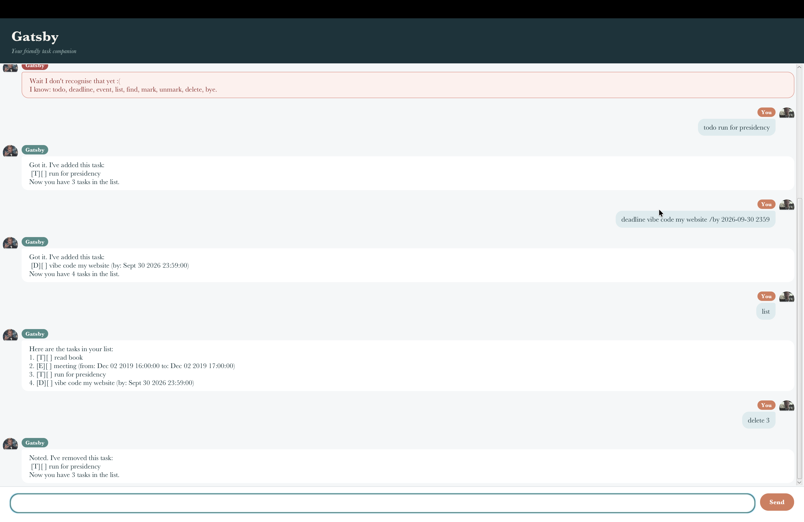

# Gatsby User Guide



Gatsby is a friendly task-management chatbot. Use it to record todos, keep track
of deadlines and events, search your tasks, and mark completed work. Gatsby saves
your tasks automatically, so they are available the next time you start the app.

## Getting started

Run Gatsby with Java 25. To start the JavaFX GUI from the project folder, run:

```bash
./gradlew run
```

Type a command in the message box and press **Enter** or click **Send**. Gatsby
also supports the same commands through the console. If you are unsure what to
type, enter `help`.

## Features

### Add a todo

Use `todo` for a task without a date or time.

```text
todo read the software engineering textbook
```

Gatsby adds the task as unfinished. A task description is required.

### Add a deadline

Use the following format to record a task that must be completed by a specific
date and time:

```text
deadline submit the assignment /by 2026-09-18 2359
```

The date and time must use the format `yyyy-MM-dd HHmm`. For example,
`2026-09-18 2359` means 11:59 p.m. on 18 September 2026.

### Add an event

Use an event when something takes place during a time range:

```text
event project meeting /from 2026-09-16 1400 /to 2026-09-16 1600
```

Both `/from` and `/to` values are required, and the end time must be later than
the start time.

### List your tasks

Use `list` to display every task. Each task has a number that can be used with
`mark`, `unmark`, and `delete`.

```text
list
```

Tasks are displayed with their type, description, completion status, and any
deadline or event timing.

### Find tasks

Use `find <query>` to search task descriptions.

```text
find textbook
find project meeting
find BOOK
```

Search is case-insensitive. A query can contain multiple words, and every query
word must appear in the description; word order does not matter. Partial matches
are supported, so `find boo` matches `read book`. Exact word matches appear
before partial matches. Search results keep the original task-list numbers.

Search checks descriptions only. It does not search task types, completion
status, deadline dates, or event times.

### Mark and unmark tasks

Use `mark <number>` to mark a task as done:

```text
mark 1
```

Use `unmark <number>` to mark it as unfinished again:

```text
unmark 1
```

The number refers to the task number shown by `list`. Gatsby tells you if the
task was already in the requested state.

### Delete tasks

Use `delete <number>` to permanently remove a task from the current list:

```text
delete 2
```

Use `list` first if you are unsure which task number to enter.

### Get help or exit

Use `help` or `?` to display Gatsby's command summary. Use `bye`, `byebye`, or
`bye bye` to end the session.

```text
help
bye
```

## Input tips and error handling

- Commands are case-insensitive, so `LIST` and `list` are equivalent.
- Gatsby rejects empty descriptions, invalid date-times, duplicate task details,
  repeated `/by`, `/from`, or `/to` parameters, and invalid task numbers.
- An event must end after it starts.
- Do not use the `|` character in task descriptions because Gatsby uses it to
  separate fields in its save file.
- If Gatsby reports an error, correct the command and continue; the session stays
  open.

## Saving your tasks

Gatsby saves the task list after adding, marking, unmarking, or deleting a task.
When Gatsby starts again, it loads the saved tasks automatically. The save file
is stored at `data/gatsby.txt` relative to the project folder.
